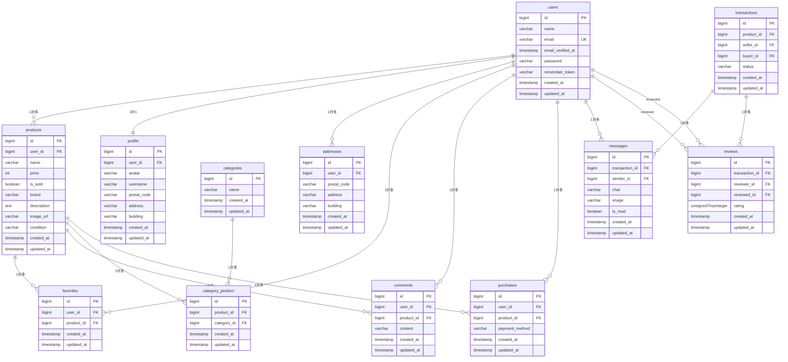

<h1>coachtech フリマアプリ</h1>

<h2>概要</h2>
・ある企業が開発した独自のフリマアプリの設計、コーディング、テストの実施

<h2>環境構築</h2>

**Dockerビルド**

1.git clone  git@github.com:matsuyamashun/furima.git

Http版はっておきます　　https://github.com/matsuyamashun/furima.git

2.DockerDesktopアプリ立ち上げ

3.docker-compose up -d --build

MacのM1・M2チップのPCの場合、no matching manifest for linux/arm64/v8 in the manifest list entriesのメッセージが表示されビルドができないことがあります。 エラーが発生する場合は、docker-compose.ymlファイルの「mysql」内に「platform」の項目を追加で記載してください

**Laravel環境構築**

1.docker-compose exec php bash

2.composer install

3..env.exampleファイルを.envに変更。または、PHP内にて**cp .env.example .env**コマンドで新しく作成

4..envファイルの変更

**DB_CONNECTION=mysql**

**+　DB_HOST=mysql**

**DB_PORT=3306**

**+DB_DATABASE=laravel_db**

**+DB_USERNAME=laravel_user**

**+DB_PASSWORD=laravel_pass**

使用するブラウザによって違うかもしれないので違う場合はその都度変更おねがいします

5.アプリケーションキー作成

php artisan key:generate

6.マイグレーション実行

php artisan migrate

7.シーティングの実行

php artisan db:seed

<h2>ログイン情報</h2>

**管理者ユーザー**
- メールアドレス: admin@example.com
- パスワード: password123

**一般ユーザー**
- メールアドレス: user@example.com
- パスワード: password123

**No.1~No.5紐づけユーザー**
- メールアドレス: seller1@example.com
- パスワード: password123

**No.6~No.10紐づけユーザー**
- メールアドレス: seller2@example.com
- パスワード: password123

**未紐づけユーザー**
- メールアドレス: no_seller@example.com
- パスワード: password123

<h2>使用技術（実行環境）</h2>

・PHP8.4.12

・Laravel 8.83.8

・MySQL8.0.26

<h2>ER図</h2>
今回開発したフリマアプリのER図になります（Marmaidにて記述しました）

 <h2>URL</h2>

 ・  開発環境::http://localhost

 .　メール認証::http://localhost:8025/　（会員登録後、購入者の取引完了後の２パターンあり）

 .  phpMyAdmin::http://localhost:8080/

 .　　カード支払いについては[https://zenn.dev/h_yokoyama/articles/html-select-style　](https://docs.stripe.com/testing#testing-interactively)
 　　　こちらを参考にしてください

<h2>テストについて</h2>

.Unitテスト実施済み

.取引後の評価のボタンは購入者のみある。購入者が評価後、出品者が取引中のタブより評価できる（両者評価で取引完了）
