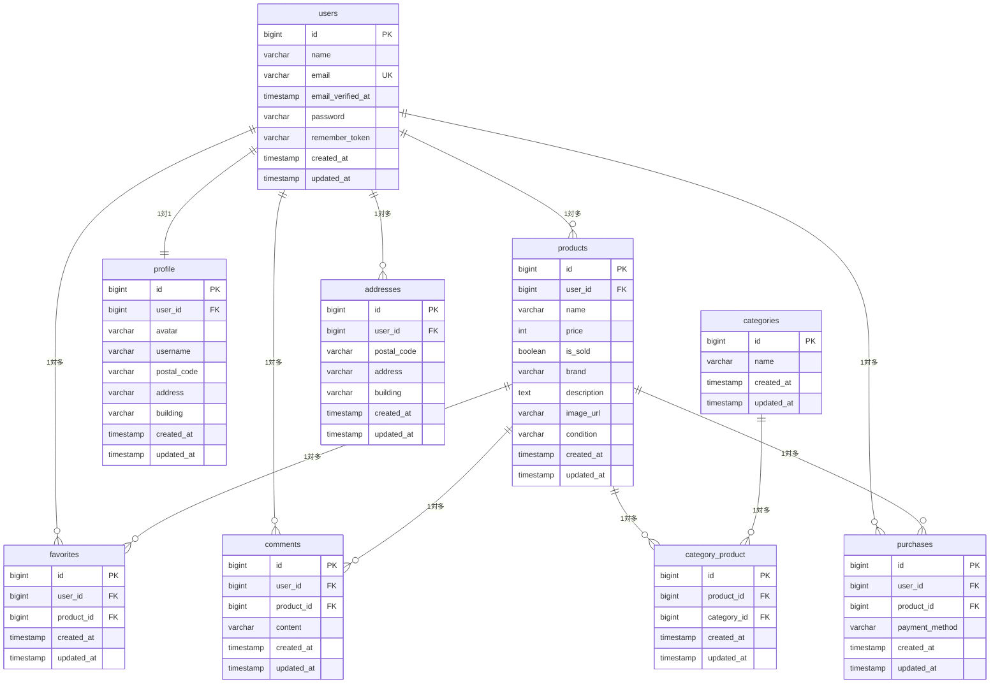

```mermaid
erDiagram

    %% ======================
    %% Users
    %% ======================
    users {
        bigint id PK
        varchar name
        varchar email UK
        timestamp email_verified_at
        varchar password
        varchar remember_token
        timestamp created_at
        timestamp updated_at
    }

    %% ======================
    %% Products
    %% ======================
    products {
        bigint id PK
        bigint user_id FK
        varchar name
        int price
        boolean is_sold
        varchar brand
        text description
        varchar image_url
        varchar condition
        timestamp created_at
        timestamp updated_at
    }

    %% ======================
    %% Profiles
    %% ======================
    profile {
        bigint id PK
        bigint user_id FK
        varchar avatar
        varchar username
        varchar postal_code
        varchar address
        varchar building
        timestamp created_at
        timestamp updated_at
    }

    %% ======================
    %% Favorites
    %% ======================
    favorites {
        bigint id PK
        bigint user_id FK
        bigint product_id FK
        timestamp created_at
        timestamp updated_at
    }

    %% ======================
    %% Comments
    %% ======================
    comments {
        bigint id PK
        bigint user_id FK
        bigint product_id FK
        varchar content
        timestamp created_at
        timestamp updated_at
    }

    %% ======================
    %% Categories
    %% ======================
    categories {
        bigint id PK
        varchar name
        timestamp created_at
        timestamp updated_at
    }

    %% ======================
    %% Category_Product
    %% ======================
    category_product {
        bigint id PK
        bigint product_id FK
        bigint category_id FK
        timestamp created_at
        timestamp updated_at
    }

    %% ======================
    %% Purchases
    %% ======================
    purchases {
        bigint id PK
        bigint user_id FK
        bigint product_id FK
        varchar payment_method
        timestamp created_at
        timestamp updated_at
    }

    %% ======================
    %% Addresses
    %% ======================
    addresses {
        bigint id PK
        bigint user_id FK
        varchar postal_code
        varchar address
        varchar building
        timestamp created_at
        timestamp updated_at
    }

    %% ======================
    %% Relations
    %% ======================

    users ||--o{ products : "1対多"
    users ||--|| profile : "1対1"
    users ||--o{ addresses : "1対多"

    users ||--o{ favorites : "1対多"
    products ||--o{ favorites : "1対多"

    users ||--o{ comments : "1対多"
    products ||--o{ comments : "1対多"

    products ||--o{ category_product : "1対多"
    categories ||--o{ category_product : "1対多"

    users ||--o{ purchases : "1対多"
    products ||--o{ purchases : "1対多"

```

							
							
							